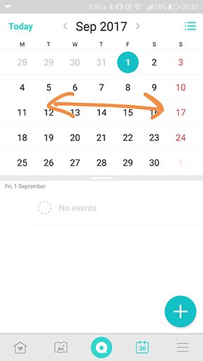
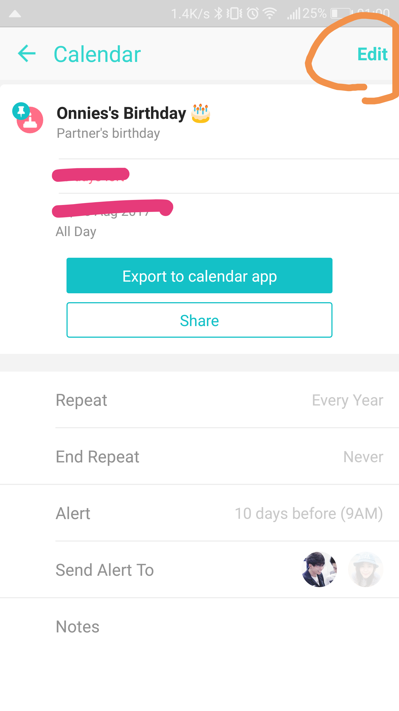

# Between feedback

ขอ feedback แค่ตัว UI อย่างเดียวก่อนกันนะครับ

ถ้าเป็นเรื่องอื่น feedback ไปอาจไม่ช่วยอะไรเพราะว่าผมอาจจะไม่ใช้ Target user ของแอป between ถ้าอยากให้ feedback บอกผมอีกทีดีกว่า

## UI feedback คร่าวๆ
#### 1. หลักๆยังต้องศึกษา UI ซักพักถึงรู้ว่าแอปทำอะไรได้บ้าง เป็นไปได้ไหมที่จะทำให้มันเข้าใจง่ายมากขึ้น โดยทำ Tututorial ไว้แต่ละหน้าพอ user กดเข้าหน้าไหนค่อยแสดง tutorial ของหน้านั้น การอัดไปครั้งเดียวตอนแรก user ก็จำไม่ได้อยู่ดีครับ

#### 2. Love letter flow
 ==>   ==> จากที่ได้ลองกดๆดูทำไมมันอยู่ตรงนี้? 

#### 3. เดาว่าส่วนนี้ทาง technical ใช้ TextView.setSize(...)ตรงๆ parallax กับการ scrollview น่าจะใช้ collapsing toolbar น่านะดีกว่า gesture มันสื่อกว่าครับ

#### 4. หน้า calendar เป็นไปได้ไหมว่า gesture จะเปลี่ยนมาเป็นปัดซ้าย/ขวา จะได้สอดคล้องกับ "< Sep 2017 >" ด้านบน

#### 5. ตัวเลข 8018 มาจากไหนแอบยังไม่เข้าใจ มันไม่ค่อยสื่อซักเท่าไหร่
 ==> 

#### 6. หน้านี้เข้าใจว่า edit ไม่ได้ตอนเห็นครั้งแรก แต่ยังดีที่เห็นปุ่ม Edit เป็นไปได้ไหมที่สามารถทำให้ให้มันอยู่หน้าเดียว ส่วนตัวคิดว่าทำได้

#### 7. เรื่องนี้แก้ปัญหาได้ด้วยการใส่เงาหรือเส้นขั้นแทนก็ได้ให้ที่ toolbar แทน จะได้ไม่ต้องไปขึ้นกับ blackground

#### 8. เป็นไปได้ไหมว่าจะเอาสองหน้านี้มารวมกัน เช่นใช้วิธี scroll ซ้าย/ขวาแทน จะได้ลดขั้นตอนการ click ของ user ลง เพราะบางทีมันอาจจะดูลึกเกินไป
 ==> 

#### 9. ด้านขวาน่าจะดู clean กว่า
 ==> 

#### 10. selector ของปุ่มต่างๆในแอปถ้าเป็น ripple effect ก็ทำให้หมดดีกว่าครับ เพราะมันส่งผลต่อ theme แอปครับ

