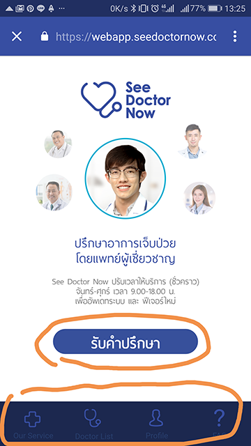
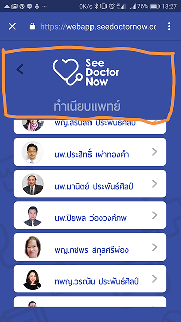
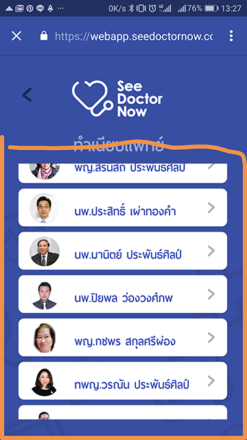
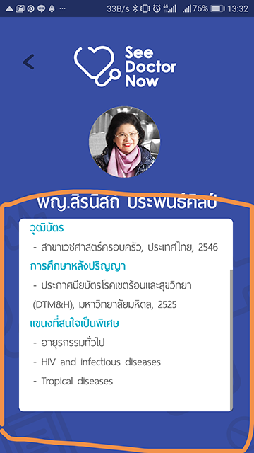
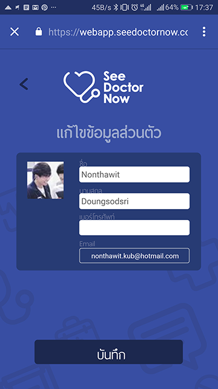
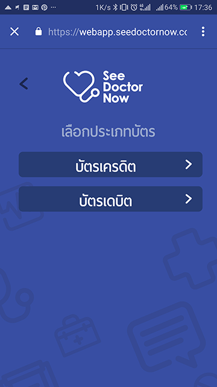
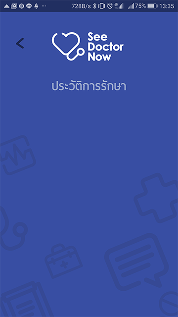
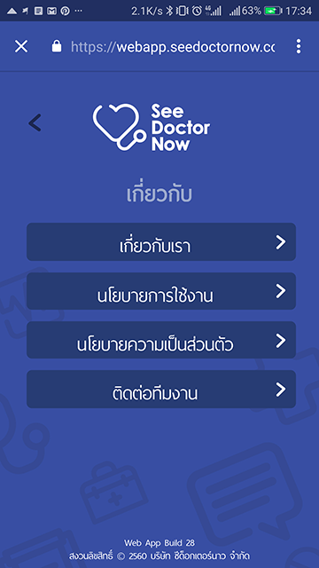
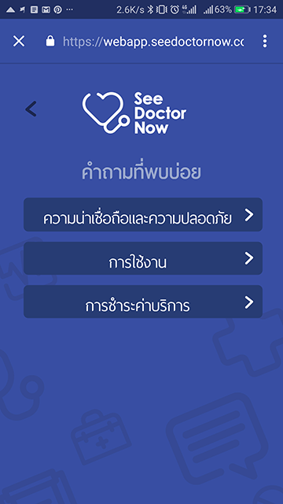
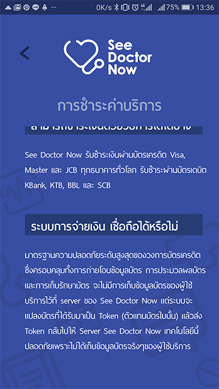

# See Doctor Now feedback

> feedback at 21/08/17

**Feedback Android platform only.**

#### 1. Android เปิดด้วย webview ไม่ควรอย่างยิ่งที่สุด

#### 2. Welcome page
    
- เปิดทุกครั้งเจอทุกครั้งเพราะความที่เป็น webview มัน handle ไม่ได้ ส่งผลให้กว่าจะได้ใช้ core feature จริงปาเข้าไป 3 - 4 click ตลอด ซึ่งไม่ควร

- indicator ใส่มาหลอกๆ แค่เปลี่ยนไปทั้งหน้าเฉยๆ

#### 3. หน้าหลัก
- ทุกปุ่มใน app ตัวหนังสือไม่อยู่กึ่งกลางบรรทัด

- bottom bar มองไม่เห็น และไม่ใส่ click state

- แต่ละหน้าควรทำให้มัน slide เพื่อเปลี่ยนหน้าได้

- flow หน้านี้เข้าใจยาก ควรนำไปอยู่ใน bottom bar เลยจะเข้าใจง่ายกว่า อาจ hight icon ให้เด่นกว่า icon อื่นก็ยังทำได้

#### 4. หน้า Doctor List
-  _**ทุกหน้า**_ไม่จำเป็นต้องมี logo "See Doctor Now" แล้วมันสูงจนไป ส่งผลให้ไปปิดการใช้งานหน้านั้นๆของ user
    
- margin/padding ตรง list view _**ทุกหน้า**_ผิดจะเห็นว่าข้างล่างเหลือซึ่งไม่ควร

- scroll bar _**ทุกหน้า**_ควรอยู่นอกสุดมากกว่าหรือไม่มีไปเลย เพราะยังไง user สามารถรู้ได้อยู่ดีว่า scroll ได้ถ้าเห็น list ของหมอเกินหน้าจอ

- ทุกหน้าในลักษณะนี้ ถ้าเป็น navtive จะได้ gesture ที่ดีกว่านี้ เนื่องจากมีส่ิงที่เรียกว่า "collapsing toolbar" มันจะทำให้ระหว่าง scroll ตัว toolbar จะถูกซ่อนอัตโนมัต

- มันควรจะ scroll ได้ทั้งหน้ามากว่าแค่กล่องเล็กๆ

#### 5. หน้า Profile
    
- สามารถออกแบบใหม่ให้ใช้งานง่ายกว่านี้ได้
    
- ประวัติการรักษาควรมี empty page
    
- การ set ข้อมูลบัตรเครดิตสามารถรวบให้เหลือหน้าเดียวได้ user ต้องเข้าไปหลายชั้นเกินไป

    
    
#### 6. หน้า Our Service กับ FAQ

- หน้า Our Service อ่านครั้งแรกนึกว่า เป็น feature ของ app ทั้งหมดว่าทำอะไรได้บ้างปรากฎไม่ใช้เป็นแค่ "เกี่ยวกับเรา" "นโยบายการใช้งาน" user จะสับสน

- หน้า Our Service กับ FAQ สองหน้านี้ควรรวบอยู่ด้วยกันแล้วเปลี่ยนชื่อ tab ไปจะดีกว่า

- สรุป tab มันจะมี 4 เหมือนเดิม ก็คือ tab แรกควรเป็นหน้า "รับคำปรึกษา" ส่วน Our Service กับ FAQ รวบให้เหลือหน้าเดียวแล้วเปลี่ยนชื่อใหม่

    
    
#### 7. หน้า FAQ

- หน้าที่มีตัวอักษรหรืออะไรที่ต้องให้ user อ่านเยอะๆ ไม่ควรมีอะไรมาปิดการอ่าน มันควร scroll ได้ทั้งหน้า เหมือน app medium

# สรุป 
- รายละเอียดเล็กๆน้อยไม่ควรมองข้ามครับ _**ทุกอย่างส่งผลต่อ user friendly หมด**_
- ทุกข้อที่พูดมามันคือข้อจำกัดของ webview ที่ทำไม่ได้เหมือน native app ถ้าเกิดยังฝืน launch อย่างนี้ออกไปคาดว่าส่งผลต่อ feedback app ที่แย่แน่นอนครับ สู้เก็บไว้ก่อนดีกว่า
- Native ยังเป็นการพัฒนา Mobile App ที่ดีที่สุดอยู่นะครับ ถ้าอยากได้ app ที่ดีต่อยอดในอนาคตได้ [https://nuuneoi.com/blog/blog.php?read_id=890]()

